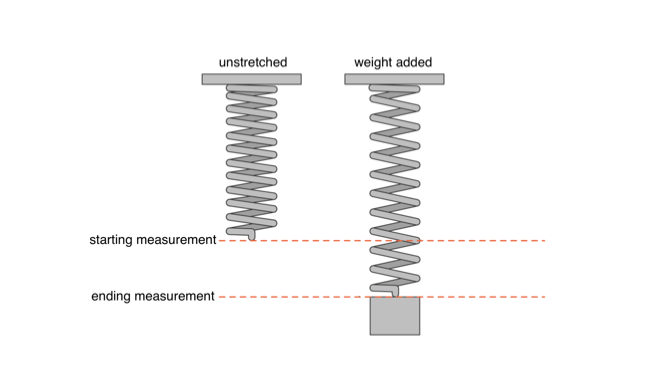
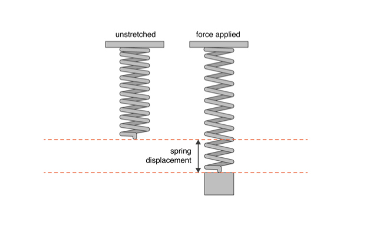

# Spring Coil Coding Exercise

## Table of Contents
- [About](#about)
- [Getting Started](#getting_started)
- [Installing](#installing)
- [Tasks](#tasks)
- [Contributing](#Contributing)

## About
As a part of a new product trial, Tesla has ordered ordered heavy duty coil springs from multiple suppliers. The quality team has completed a series of weight tests to help evaluate the coil springs. They have supplied us with the test data they collected.

A quality team member explains the tests they completed as the following:
> We start with a spring with no weight on it and measured the distance to the bottom of the spring from the top of the stand. We record this measurement as "start_measurement_m". We then hang a known mass on the spring and wait for it to stop moving. Again, we measure the distance from the bottom of the spring to the top of the stand. We record this measurement as "end_measurement_m". We hung a series of increasingly heavier weights on the spring, measuring the spring each time and recording the results into a file. We repeated this process for multiple springs.

<p align="center">
  
</p>

### Hooke's law of elasticity
The magnitude of the force required to change the length of a spring is directly proportional to the spring constant and the displacement of the spring.

  **_f = kx_**

The force, F, stored in a spring is linearly related to the distance the spring has been stretched (or compressed). When a spring is stretched it exhibits spring displacement, x, this is the difference between the spring length after force is applied and the spring length with no force applied. The All springs have an elastic limit, beyond which the law fails. (Those of you who have stretched a Slinky too far know this all too well). The constant of proportionality, k, is called the spring constant. If the spring is stiff (like the ones needed for our new product), k is large. If the spring is weak (like the spring in a ballpoint pen) k is small. Knowing the value k of a particular spring can be matter of some importance.

The force, F, being exerted on the spring is equal to the mass, m, multiplied by the acceleration due to gravity, g (9.81 m/s2), so we substitute m*g for F:

  **_(m * g) = kx_** <br />
  also can be written as, <br />
  **_(m * 9.81) = kx_**

<p align="center">
  
</p>

## Getting_Started
This repo makes use of `Makefile` for run and compilation.  This repo also makes use of `MICROMAMBA` to bootstrap fully functional conda-environments.  It’s main usage is in continous integration pipelines: since it’s a single executable, it reduces dramatically bandwidth usage and provide fast operations.

To get started, please git clone this repo.
```
git clone https://github.com/jc695/tesla.git
```

**NOTE**
*This application was built in MacOS.  If you are running on Windows, please ignore the following instructions and proceed to the installing section below.*

Next, make sure you're in the parent directory.  Once in the parent directory, you can run `make` to see the list of run commands from the `Makefile`.
```
run                            Run the program on the provided dataset
test                           Run tests
```

To execute all the results from tasks below, please run the following.
```
make run
```

To run some unit testing, please run the following.
```
make test
```

In case you need to restart or reconfigure your venv and dependencies, please run the following.
```
make clean
```


## Installing
installation instructions

## Tasks

### Task 1
Test result data is provided in the folder titled “test_results”. Each file represents one test for one spring from a specific supplier. Load the result data from Suppliers A, B, and C into a common format.

**John's Response:**
> See main.py and utiliies.py scripts to see how the data gets read, preprocessed, and then transformed.  

### Task 2
For each test, calculate Force and Spring Displacement. Generate a scatter plot with Force on the X-axis and Spring Displacement on the Y-axis. Save the scatter plot to a file(s).

**John's Response:**
> See main.py and utilities.py scripts to see how Force and Sprint Displacement was calculated.  Scatter plots are saved for each TestResults file.  Based on the availble test results, there should be 3 png files in the output folder.  The png files related to task 2 are specified with suffix 'output_no_best_fit_line.png'.

### Task 3
For each test, calculate the line of best fit and plot the line. Describe your method for how you defined the line of best fit and any comments you have regarding the results. Save the plot to a file(s) with the line of best fit included. (Please note, we understand that your line may not be the best match for the data)

**John's Response:**
> To calculate the line of best fit, I used the sklearn library calling the LinearRegression module.  sklearn's LinearRegression library is well maintained and works pretty well to quickly calculate the best fit line.  The independent variable is Force and the dependent variable is Sprint Displacement.  The line of best fit will be red color.  I created additional scatterplot charts with the best fit line included.  The png files related to task 3 are specified with suffix 'output_w_best_fit_line.png'.

Additional observation...
> Based on the data points plotted, there is an obvious positive relation between Force and Spring Displacement.  Another observation that can be seen is that approximately after 1.8m+ in Spring Displacement, we can see that the data points plateaus.  Initial assumptions would be that the plateau indicates the spring has reached it's max elasticity or stretch.

### Task 4
It's possible that during our engineer's testing, the springs reached its elastic limit and stretched beyond its original length. Review and remove data points that were calculated after the spring reached its elastic limit (hint: the original length of the spring is constant with a mass of 0). Then calculate the line of best fit and plot the line. Describe your method for how you defined the line of best fit and any comments you have regarding the results. Save the plot to a file(s) with the line of best fit included.

**John's Response:**
> asdf

### Task 5
Using Hooke's Law of Elasticity, determine the k-value (spring constant) for each spring.

**John's Response:**
> See main.py and utilities.py scripts to see how k-value (spring constant) was calculated for each spring.

### Task 6
No code is required for this task. Please record responses in whatever medium you see fit.
- Given the data and calculations you have made, what information can you tell us about each spring?
- Is there any additional information or data do you wish you had?
- Do you have enough information to provide any recommendations to the quality team?

**John's Response:**
> asdf


## Contributing
No contributions please.
